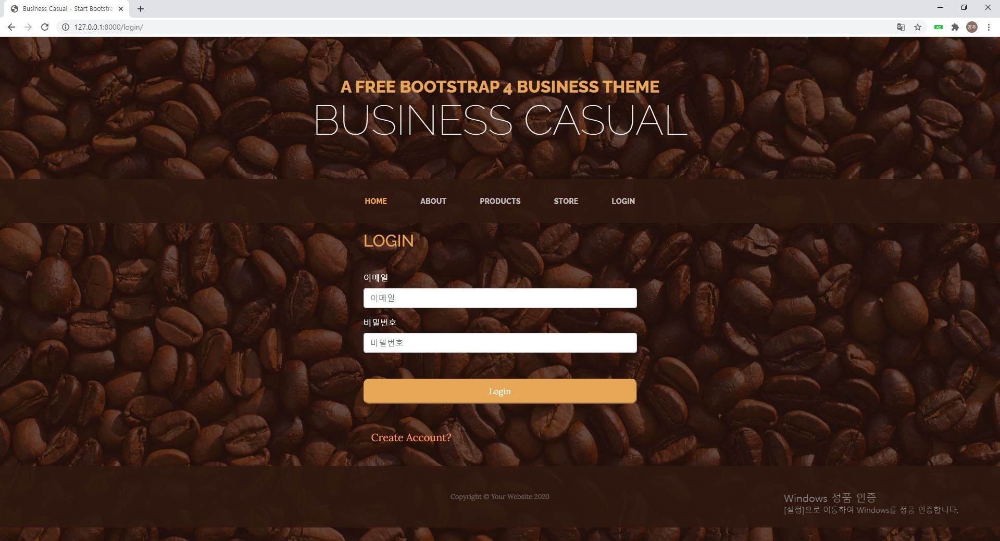
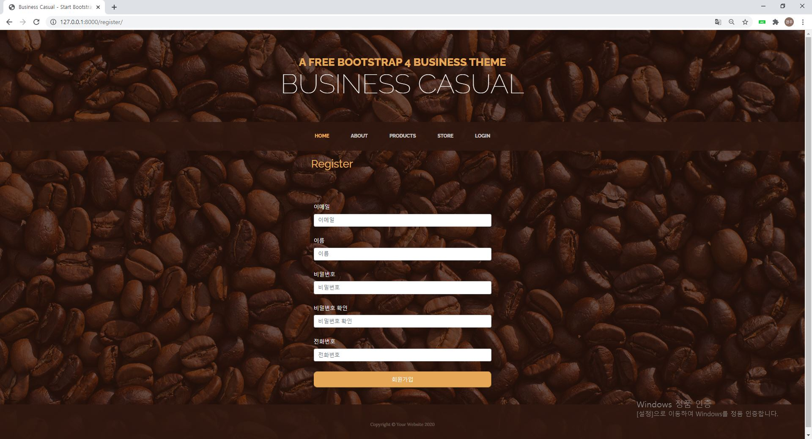
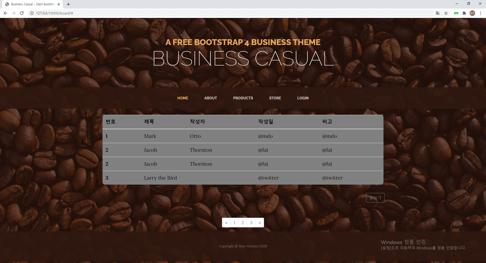
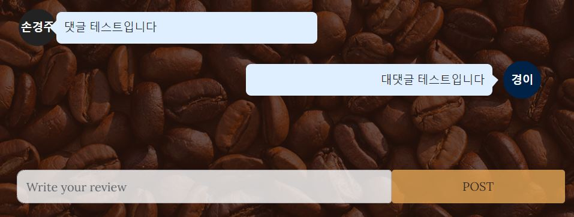
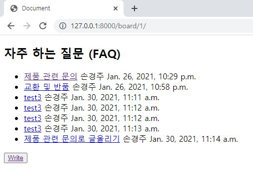
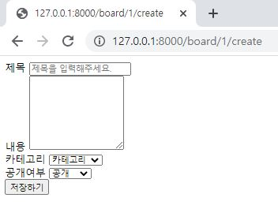
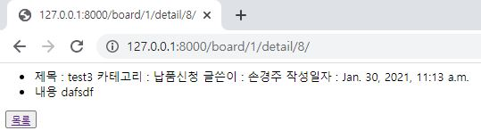
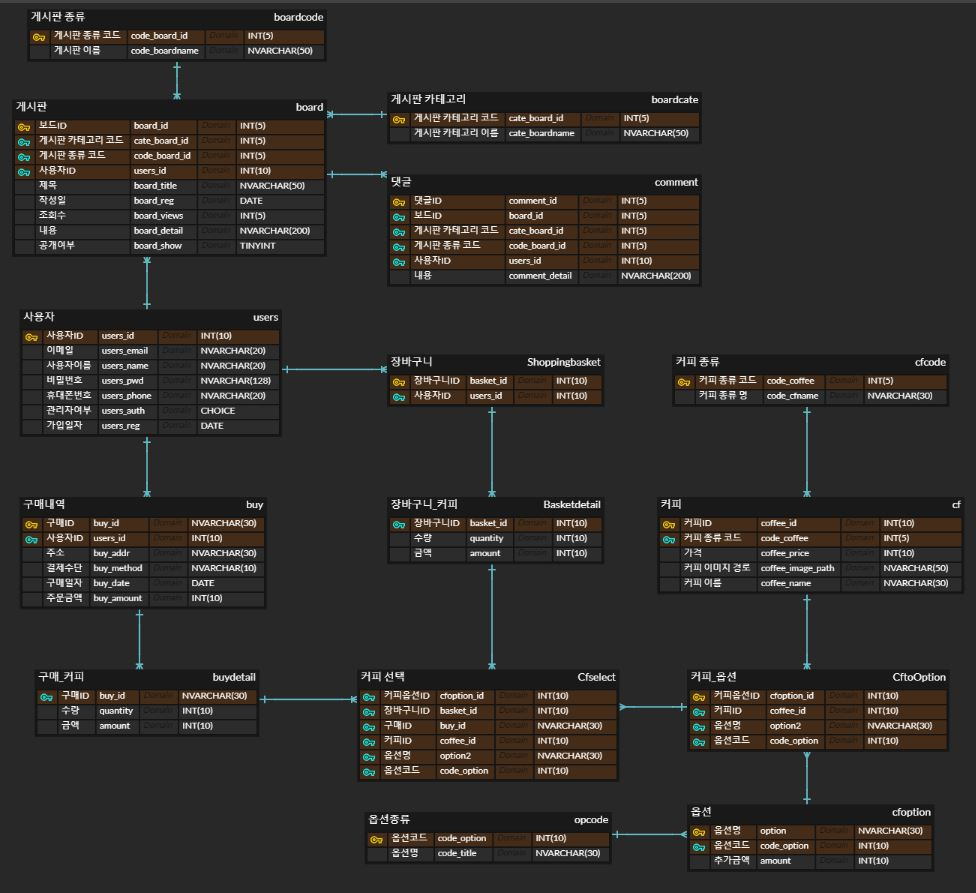

# CoffeeShop Project

　

## 개요

　

* 1조의 Web 프로젝트
* Django를 사용하여 온라인 커피숍을 구축한다.
* 일반적인 회원가입, 로그인부터 시작해서 커피의 구매와 문의 기능까지 추가할 예정이다.

　

## 팀원

　

* 손경주
  * 사용가능 언어 : Python, Java, C++
  * 취미 : 운동, 독서, 영화
  * 개발분야 : Embedded System, Android App Develop
  * Blog : [경주의 코딩일기](https://sohn0356-git.github.io)
  * Contact : sohn0356@naver.com

　

* 한상범
  * 사용가능 언어 : Python(노력중)...
  * 취미 : 요리, 영화
  * 개발 분야 : 아직 고민중입니다.
  * Contact : morpheus3263@gmail.com
  

　

* 한재영

  * 사용가능 언어: Python, C 미흡
  * 취미: 요리, 영화
  * 개발 분야: 미정..
  * Contact: han042501@naver.com

　

## 페이지 설계

　

#### 화면 UI 설계

　

* login 화면 설계

　

* register 화면 설계

　

* board 첫 화면 설계

　

* comment 화면 설계

　

#### 테이블 설계

　

* board 첫 화면 설계

　

* board 추가 화면 설계

　

* board detail 화면 설계

　

#### 테이블 설계

* ERD 설계

　

#### URL 설계

| URL 패턴                                        | 뷰 이름                |               설명               |
| ----------------------------------------------- | ---------------------- | :------------------------------: |
| /                                               | index                  |  들어왔을 때 처음 보여지는 화면  |
| /user                                           | UserLV(ListView)       |       사용자 리스트를 출력       |
| /register                                       | RegisterView(FormView) |  새로운 사용자를 등록하는 화면   |
| /login                                          | LoginView(FormView)    |         로그인 하는 화면         |
| /logout                                         | logout                 |        로그아웃 하는 화면        |
| /board/(?P<pk>\d{1})                            | boards                 |  게시판별로 글을 출력하는 화면   |
| /board/(?P<pk>\d{1})/create                     | board_write            |   게시판에 글을 생성하는 화면    |
| /board/(?P<pk>\d{1})/detail/(?P<id>\d+)         | board_detail           |                                  |
| /board/(?P<pk>\d{1})/detail/(?P<id>\d+)/comment | comment_write          |        댓글 작성하는 화면        |
| /board/list                                     | BoardLV(ListView)      | 게시판의 모든 글을 출력하는 화면 |
|                                                 |                        |                                  |
|                                                 |                        |                                  |

　

#### 작업/코딩 순서

| 작업순서          | 관련 명령/파일    | 필요한 작업 내용                                             |
| ----------------- | ----------------- | ------------------------------------------------------------ |
| 뼈대 만들기 💀     | startproject      | coffeeshop project생성                                       |
|                   | settings.py       | templates, static경로 지정                                   |
|                   | migrate           |                                                              |
|                   | createsuperuser   | root 계정생성                                                |
|                   | startapp          | cfuser생성                                                   |
|                   | settings.py       | cfuser app 추가-----(210125)-----                            |
|                   | startapp          | cfboard생성                                                  |
|                   | settings.py       | cfboard app 추가-----(210126)-----                           |
|                   |                   |                                                              |
|                   |                   |                                                              |
| 모델 코딩하기 📚   | cfuser.models.py  | email, name, password, phone, level, register_date를 맴버로 갖는 Cfuser 클래스 생성(models.Model상속) |
|                   | cfuser.admin.py   | admin페이지에 Cfuser 추가                                    |
|                   | makemigrations    |                                                              |
|                   | migrate           | -----(210125)-----                                           |
|                   | cfboard.models.py | category, boardname, userid, title, reg_date, views, content, displosure을 맴버로 갖는 Cfboard 클래스 생성(models.Model상속) |
|                   | cfboard.admin.py  | admin페이지에 Cfboard,Boardcode,Boardcate 추가               |
|                   | makemigrations    |                                                              |
|                   | migrate           | -----(210126)-----                                           |
| URLconf 코딩하기🔧 | Coffeeshop.urls   | admin과 cfuser url 정리                                      |
|                   | cfuser.urls       | cfuser의 url정리                                             |
|                   | cfuser.views      | index, RegisterView, LoginView, logout, UserLV 생성          |
|                   | cfuser.forms      | RegisterForm, LoginForm 생성                                 |
|                   | templates         | base.html, index.html, login,html, register.html, cfuser_list.html 생성-----(210125)----- |
|                   | Coffeeshop.urls   | admin과 cfboard url 정리                                     |
|                   | cfboard_list.html | boardlist를 출력하는 html생성                                |
|                   | cfboard.urls      | cfboard의 url정리-----(210126)-----                          |
|                   | board.html        | board.html 생성 (게시판 틀)                                  |
|                   | boardwrite.html   | boardwrite.html 생성(게시판 글쓰기 틀), base.html 수정       |
|                   | boarddetail.html  | boarddetail.html 생성(게시판 상세보기 폼),  글쓰기 폼에 summernote 적용 |
|                   | cart.html         | cart.html (장바구니 페이지) 생성                             |
|                   | buy_page.html     | buy_page.html(구매 상세 페이지) 생성                         |
|                   | order.html        | order.html(구매이력 조회 페이지) 생성                        |
|                   | graph.html        | graph.html(관리자그래프 페이지) 생성                         |
|                   | map.html          | map.html(지도 페이지) 생성                                   |
|                   |                   |                                                              |
|                   |                   |                                                              |
|                   | cfboard.views     | board_write기능 추가                                         |
|                   | templates         | cfboard_list.html, cfboard_write.html, cfboard.html 추가     |
|                   | cfboard.views     | board_detail 추가 -----(210130)-----                         |